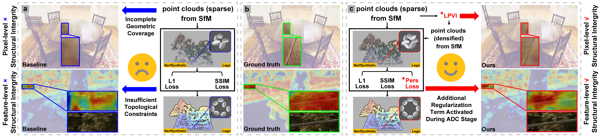
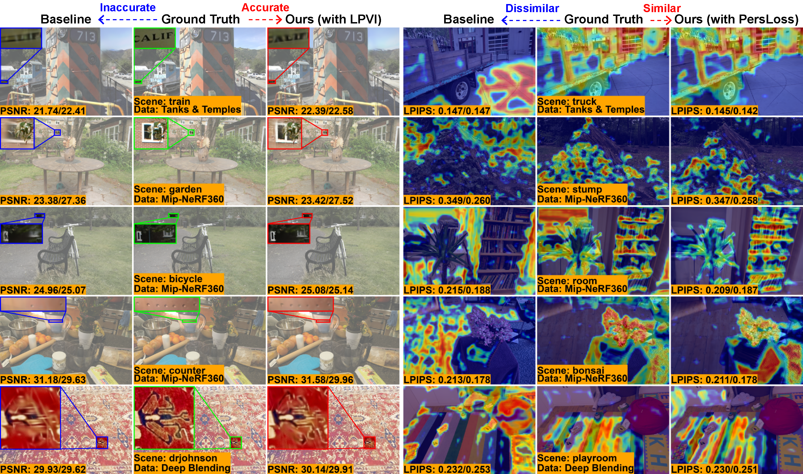

# [AAAI2025] Topology-Aware 3D Gaussian Splatting: Leveraging Persistent Homology for Optimized Structural Integrity

[Tianqi Shen](https://github.com/AmadeusSTQ), [Shaohua Liu](https://github.com/ShaohuaL), [Jiaqi Feng](https://github.com/fengjiaqi927), [Ziye Ma](https://gavenma.github.io/), [Ning An]() <br />

> Notice: This repository serves as a mirror of the [original repository](https://github.com/AmadeusSTQ/Topology-GS).

[[`Project Page`]()][[`Arxiv`](https://arxiv.org/abs/2412.16619)]

## News

**[2024.12.25]** We release the codes, Marry Christmas!

## TODO List
- [ ] Provide the environment file for the codes: ```environment.yml```
- [ ] Provide codes for rendering depth and effects of LPVI
- [ ] Create a project page.

## Overview

This work introduces Topology-Aware 3D Gaussian Splatting (Topology-GS), which addresses two key limitations in current approaches: compromised pixel-level structural integrity due to incomplete initial geometric coverage, and inadequate feature-level integrity from insufficient topological constraints during optimization.

<p align="center">

</p>

To overcome these limitations, Topology-GS incorporates a novel interpolation strategy, Local Persistent Voronoi Interpolation (LPVI), and a topology-focused regularization term based on persistent barcodes, named PersLoss.

<p align="center">

</p>

LPVI utilizes persistent homology to guide adaptive interpolation, enhancing point coverage in low-curvature areas while preserving topological structure. PersLoss aligns the visual perceptual similarity of rendered images with ground truth by constraining distances between their topological features.

## Installation

We conducted our tests on a server running Ubuntu 18.04, CUDA 11.8, and GCC x.x.x. 
While other similar configurations are expected to work, we have not individually verified each one.

1. Clone this repo:

```
git clone https://github.com/AmadeusSTQ/Topology-GS --recursive
cd Topology-GS
```

2. Install dependencies

```
SET DISTUTILS_USE_SDK=1  # Windows only
conda env create --file environment.yml
conda activate topology_gs
```
> Notice1: You do not need to install pytorch-grad-cam. Please use the modified pytorch-grad-cam code provided in this repository.

> Notice2: You need to compile and install the TopologyLayer provided in this repository yourself.

## Topo-beginners
For beginners unfamiliar with topological data analysis (TDA), we provide a toy example.
You can simply run ```TOPO_users/toy_persistence.py``` to get started.

## Data
The preparation of data is completely consistent with [Scaffold-GS](https://github.com/city-super/Scaffold-GS).

## Pre-processing
- For LPVI, you don't need to manually interpolate the sparse point cloud from SFM. The interpolation will be done automatically in ```scene/__init__.py```.
- For PersLoss, you need to manually run ```TOPO_users/compute_persist.py``` to generate the persistent homology files.

## Training

### Training multiple scenes

To train multiple scenes in parallel, we provide batch training scripts:

```cd scripts```
- Deep Blending: ```train_db.sh```
- MipNeRF360: ```train_mipnerf360.sh```
- Tanks & Temples: ```train_tandt.sh```

run them with

 ```
bash train_xxx.sh
 ```

> Notice 1: Make sure you have enough GPU cards and memories to run these scenes at the same time.

> Notice 2: Each process occupies many cpu cores, which may slow down the training process. Set ```torch.set_num_threads(32)``` accordingly in the ```train.py``` to alleviate it.

### Training a single scene

To train a single scene, you simply need to provide the YAML configuration file for the scene and run train.py:

```
python train.py --cfg experiments/scaffold/db/playroom/baseline.yaml
```

- dataset_name: ```db``` ;
- scene_name: ```playroom``` ;
- algorithm_name: Use ```baseline.yaml``` for Scaffold-GS, ```baseline_aug.yaml``` for Topology-GS (with LPVI only), and ```baseline_loss.yaml``` for Topology-GS (with PersLoss only);
- For details on other parameters, please refer to the YAML files and config.py located in the ```experiments``` folder.

> Usually, these parameters are consistent with Scaffold-GS.


This script will store the results into ```./outputs``` automatically.

## Evaluation

Scaffold-GS has integrated the rendering and metrics calculation process into the training code. So, when completing training, the ```rendering results```, ```fps``` and ```quality metrics``` will be printed automatically. And the rendering results will be save in the log dir. Mind that the ```fps``` is roughly estimated by

```
torch.cuda.synchronize();t_start=time.time()
rendering...
torch.cuda.synchronize();t_end=time.time()
```

which may differ somewhat from the original 3D-GS, but it does not affect the analysis.

Meanwhile, we retain the manual rendering function with usage similar to its counterpart in [3D-GS](https://github.com/graphdeco-inria/gaussian-splatting). You can run it by:

```
python render.py --cfg experiments/scaffold/db/playroom/baseline.yaml  # Generate renderings
python metrics.py --cfg experiments/scaffold/db/playroom/baseline.yaml  # Compute error metrics on renderings
```

## Visualization
- We provide ```TOPO_users/plot_featuremap.py``` to visualize the feature maps similar to those in the paper.
  Please note that the ```pytorch_grad_cam``` used in the code has been modified by us,
  so it differs from the [original repository](https://github.com/jacobgil/pytorch-grad-cam) content.
- We will provide the code for visualizing the depth maps in the paper.
- We will provide the code for rendering the interpolation results of LPVI as shown in the paper.

## GS-Viewer
The viewer for Topology-GS and Scaffold-GS use the same [gs-viewer](https://github.com/city-super/Scaffold-GS/tree/main/SIBR_viewers).


## Contact

- Tianqi Shen: tianqshen5-c@my.cityu.edu.hk
- Shaohua Liu: liushaohua@buaa.edu.cn

## Citation

If you find our work helpful, please consider citing:

```bibtex
@misc{shen2024topologyaware3dgaussiansplatting,
      title={Topology-Aware 3D Gaussian Splatting: Leveraging Persistent Homology for Optimized Structural Integrity}, 
      author={Tianqi Shen and Shaohua Liu and Jiaqi Feng and Ziye Ma and Ning An},
      year={2024},
      eprint={2412.16619},
      archivePrefix={arXiv},
      primaryClass={cs.CV},
      url={https://arxiv.org/abs/2412.16619}, 
}
```

## LICENSE
Please follow the LICENSE of [Scaffold-GS](https://github.com/city-super/Scaffold-GS).

## Acknowledgement
- Thanks to [3D-GS](https://github.com/graphdeco-inria/gaussian-splatting) and [Scaffold-GS](https://github.com/city-super/Scaffold-GS) for providing the foundational code framework.
- Thanks to [pysot](https://github.com/STVIR/pysot) for the hyperparameter management code framework.
- Thanks to [pytorch-grad-cam](https://github.com/jacobgil/pytorch-grad-cam) for the feature map visualization method.
- Thanks to [TopologyLayer](https://github.com/bruel-gabrielsson/TopologyLayer) for implementing persistent homology in a differentiable form as PyTorch modules.
- Thanks to Dr. [Ali Zia](https://scholar.google.com.au/citations?user=BVBJ06QAAAAJ), Postdoctoral Research Fellow at the Australian National University, for his pivotal introduction to TDA.
- Thanks to Tianqi’s girlfriend, [Lu Huang](http://www.dongsuweigroup.com/Members), a PhD candidate at Peking University, for her help in creating the nice figures in the paper.
- Thanks to the AAAI2025 reviewers JwBB, e6Pu, and iewT for their valuable feedbacks.